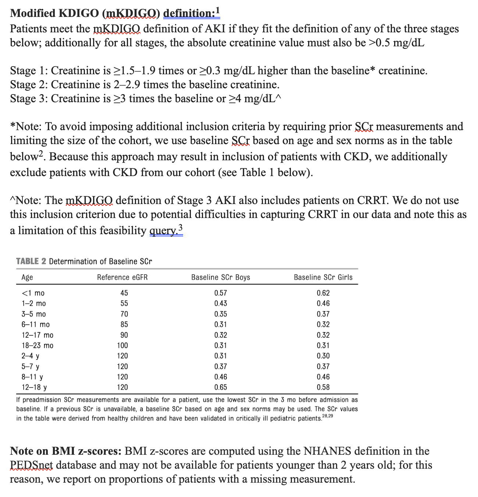

# Resources for bone marrow studies

This repository includes PEDSnet resources that may be useful for planned/ongoing bone marrow studies. The repository is structure using the PEDSnet standard framework and set up to be run against an EHR in the PEDSnet data model on a Postgres database; code will likely need to be adapted to run in other settings.

## AKI

Code for a modifidied KDIGO (mKDIGO) definition of AKI that was implemented for a prior feasibility query is in [driver_aki.R](./code/driver_aki.R). The cohort output at line 404 is the set of patients who meet the AKI definition below. Codesets that are used in the code can be found in the [specs](./specs) subdirectory.

Code for the KDIGO AKI definition (which uses CRRT data) is in development, and we will update this repository with that code once it becomes available.

## eGFR

This repository includes code for computing eGFR values; it is part of the CKD Phenotype code used for the Clinical Insights Report--code for all steps up through the step at which eGFRs are computed was included. Functions are defined in [cohort_egfr.R](./code/cohort_egfr.R) and called in [driver_egfr.R](./code/driver_egfr.R). Accompanying codesets can found in the [specs](./specs) subdirectory. Please see the function definitions for further documentation.

## CKD Phenotype

This repository includes the code, adapted for the Nephrology Data Insights dashboard, for computing the Chronic Kidney Disease phenotype.

**PLEASE NOTE** the PRESERVE definition requires a lower eGFR bound of 15, so [this line](./code/driver_ckd_nephdatainsights.R#L27) may need to be changed based on study requirements

## Composite Renal Outcome

This repository includes code to compute the eGFR elements of this outcome. Functions are defined in [cohort_renal_outcome_CER.R](./code/cohort_renal_outcome_CER.R) and executed in [driver_renal_outcome_CER.R](./code/driver_renal_outcome_CER.R)

[Transplant](https://doi.org/10.24373/pdsp-12) and [chronic dialysis](https://doi.org/10.24373/pdsp-13) phenotypes developed for PRESERVE can be found on PEDSpace (with links to all relevant code & codesets).

## Proteinuria

This repository includes code to classify & compute proteinuria. Some manual review of lab results may be required to address data quality issues & improve classification completeness.

Functions are called in [cohort_proteinuria_CER.R](./code/cohort_proteinuria_CER.R) and executed in [driver_proteinuria_CER.R](./code/driver_proteinuria_CER.R)

The following codesets are needed to execute the analysis

-   [lab_urine_protein_qual](https://github.com/PRESERVE-Coordinating-Center/PRESERVE_Variables/blob/main/codesets/measurement/lab_urine_protein_qual.csv) -- qualitative urine protein labs (in PRESERVE Variables repository)
-   [lab_urine_protein_quant](https://github.com/PRESERVE-Coordinating-Center/PRESERVE_Variables/blob/main/codesets/measurement/lab_urine_protein_quant.csv) -- quantitative urine protein labs (in PRESERVE Variables repository)
-   [vs_result_unit](./specs/vs_result_unit.csv) -- PCORnet result_unit valueset
-   [vs_result_qual](./specs/vs_result_qual.csv) -- PCORnet result_qual valueset
-   [vs_result_modifier](./specs/vs_result_modifier.csv) -- PCORnet result_modifier valueset

## PMCA

The PMCA algorithm is available to run in both the PCORnet and PEDSnet CDMs. The PCORnet implementation can be found in this repository, where the functions are in [cohort_pmca_pcornet.R](./code/cohort_pmca_pcornet.R) and the execution is in [driver_pmca_pcornet.R](./code/driver_pmca_pcornet.R).

The PEDSnet implementation can be found on [PEDSpace](https://hdl.handle.net/20.500.14642/1194)

## Cardiac Comorbidity

This code relies on the PMCA "cardiac" body system in order to identify patients in this subcohort. The functions can be found in [cohort_cardiac_CER.R](./code/cohort_cardiac_CER.R) and the execution can be found in [driver_cardiac_CER.R](./code/driver_cardiac_cer.R)

## Visits per person year

The code included in this repository will compute ED visits and hospitalization days (based on length of stay) per person year for the study cohort. The function can be found [cohort_visits_ppy_CER.R](./code/cohort_visits_ppy_CER.R) and the execution in [driver_visits_ppy_CER.R](./code/driver_visits_ppy_CER.R)

## Concept sets

If you require any additional concept sets aside from what is listed here, please take a look in [PEDSpace](https://www.pedsnet.org/metadata/home), our metadata repository where we archive concept sets used in prior studies.

### Stem cell transplants

A [concept set](./specs/transplant_px.csv) to identify patients who had undergone hematopoietic stem cell transplants was developed for a prior PEDSnet study. The team took a lenient approach in reviewing this codeset, as the investigator wanted to cast a wider net for chart reviews.

The overall false positive rate was 16%, which included both cases where no transplant had occurred and cases where the transplant was but for a different disease. The team reviewed the codeset after chart reviews and found that none of the codes consistently yielded all the false positive cases. Among the 84% identified as true positives, 85% had transplant dates in the EHR that were within three days of the dates recorded by the chart reviewers. For all analyses, the team used the transplant dates provided by the chart reviewers.

### Diabetes

A [concept set](https://github.com/PRESERVE-Coordinating-Center/PRESERVE_Variables/blob/main/codesets/condition/dx_diabetes.csv) from the PRESERVE Variables repository to identify patients with a diabetes diagnosis

### Hypertension

A [concept set](https://github.com/PRESERVE-Coordinating-Center/PRESERVE_Variables/blob/main/codesets/condition/dx_hypertension.csv) from the PRESERVE Variables repository to identify patients with a hypertension diagnosis. Another [concept set](https://github.com/PRESERVE-Coordinating-Center/PRESERVE_Variables/blob/main/codesets/condition/dx_hypertension_no_pregnancy.csv) is also available that excludes pregnancy-related hypertension diagnoses.

### Drugs

Relevant drug concept sets are stored in the public [PRESERVE Variables](https://github.com/PRESERVE-Coordinating-Center/PRESERVE_Variables/tree/main/codesets/drug) repository. For antihypertensives, includes concept sets for ACE inhibitors, ARBs, Beta Blockers, Calcium Channel Inhibitors, Loop Diuretics, & Thiazides, with files for full concept sets as well as concept sets without IV drugs.

It also includes two concept sets for nephrotoxic drugs -- these will need to be re-evaluated to confirm they align with the current NINJA classifications.
